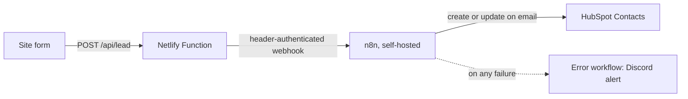

# Web form to HubSpot (Netlify Function + n8n)

A lead-capture chain: a website contact form posts to a serverless function, which validates the submission and forwards it to n8n, which creates or updates the contact in HubSpot.

Built for Rise Above Finance, a financial advisory firm whose site had no enquiry form. Shared with the client's permission.

**Status:** built and tested end to end on a test instance.

This repo is a showcase copy. It holds the automation only (not the website), and credentials and server addresses are placeholders.

## What it does

## Reliability decisions

- Allow-listed fields — the function accepts 8 named fields and strips everything else
- Fail-closed validation — required fields, length caps and an email check, anything wrong is rejected
- Honeypot — bot submissions are accepted silently and never forwarded
- Generic errors — the function returns 502 or 503 without saying why, so it leaks nothing about the setup
- Timeout — 8 seconds on the call to n8n
- Shared secret — the webhook only accepts requests carrying the token header
- No duplicates — HubSpot is updated on email, so a repeat submission updates the contact
- Error workflow — a forced-failure test fired the Discord alert

## Tests

`node tests/lead.test.js` runs 10 tests against the function with n8n stubbed out. 10 of 10 pass.

## My role

I found the gap in discovery (no enquiry form, so clients came by referral), proposed the form and set the requirements. Claude Code wrote the function and the tests under my direction. I built both n8n workflows and the self-hosted n8n by hand, with step-by-step guidance, and configured HubSpot and Netlify.

## Files

- `netlify/functions/lead.js` — the serverless function
- `tests/lead.test.js` — the tests
- `workflows/lead-to-hubspot.json` — n8n: webhook to HubSpot
- `workflows/error-handler-discord.json` — n8n: error alert
- `.env.example` — the two environment variables, names only
